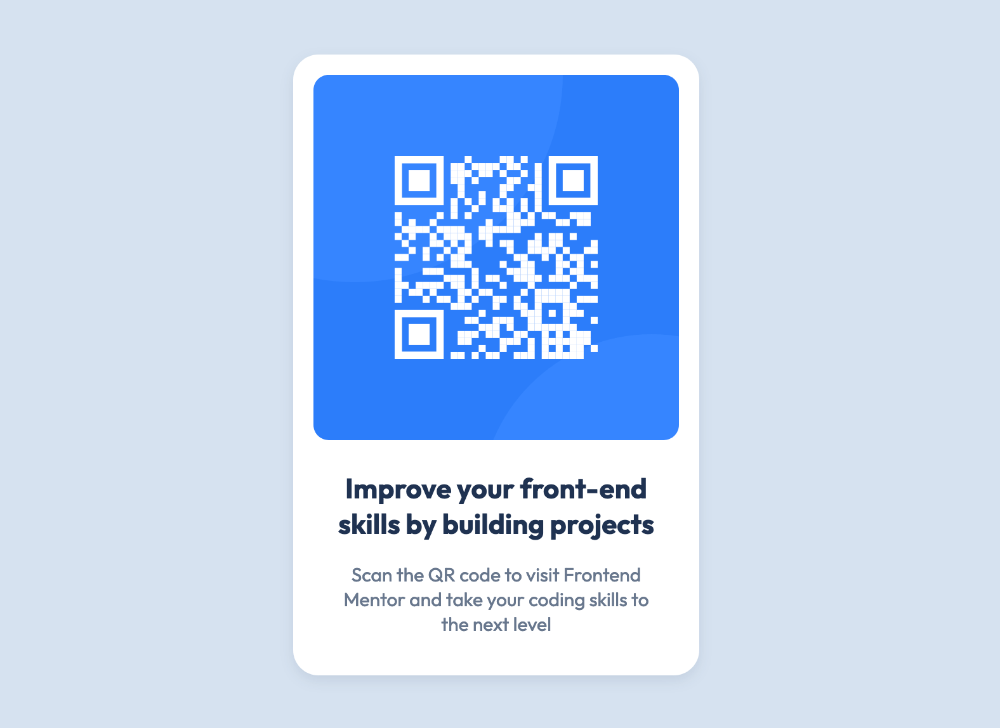

# Frontend Mentor - QR code component solution

This is a solution to the [QR code component challenge on Frontend Mentor](https://www.frontendmentor.io/challenges/qr-code-component-iux_sIO_H). Frontend Mentor challenges help you improve your coding skills by building realistic projects.

## Table of contents

- [Overview](#overview)
  - [Screenshot](#screenshot)
  - [Links](#links)
- [My process](#my-process)
  - [Built with](#built-with)
  - [What I learned](#what-i-learned)
  - [Continued development](#continued-development)
  - [Useful resources](#useful-resources)
- [Author](#author)
- [Acknowledgments](#acknowledgments)

## Overview

### Screenshot

 <!-- Add your screenshot path here -->

### Links

- Solution URL: [My Solution URL](https://github.com/lgwarda/QR-code-component.git)
- Live Site URL: [My Live Site URL](https://lgwarda.github.io/QR-code-component/)

## My process

### Built with

- Semantic HTML5 markup
- CSS custom properties
- Flexbox
- Mobile-first workflow
- [Google Fonts](https://fonts.google.com/) - For typography

### What I learned

During this project, I learned how to effectively implement responsive design using CSS Flexbox and media queries. I also gained a deeper understanding of how to use Google Fonts to enhance typography in my projects.

For example, I used the following CSS to style the QR code component:

```css
.qr-container {
  text-align: center;
  background-color: hsl(0, 0%, 100%);
  padding: 20px;
  border-radius: 10px;
  box-shadow: 0 4px 10px hsl(218, 44%, 22%);
}
```

### Continued development

In future projects, I want to focus on improving my knowledge of CSS Grid for layout management and exploring animations to create more engaging user interfaces. Additionally, I aim to delve deeper into accessibility best practices.

### Useful resources

- [CSS Tricks - Flexbox Guide](https://css-tricks.com/snippets/css/a-guide-to-flexbox/) - This resource helped me understand how to align items effectively using Flexbox.
- [Google Fonts Documentation](https://fonts.google.com/) - This was useful for learning how to incorporate custom fonts into my project.

## Author

- Frontend Mentor - [@lgwarda](https://www.frontendmentor.io/profile/lgwarda)

## Acknowledgments

A big thank you to the Frontend Mentor community for providing great challenges that help sharpen my skills. Also, I appreciate the resources and tutorials available online that guided me through the design process.
